# Overview
This data science project aims to compile information on covid cases in NYC in the past couple months and show the change in cases before and after the easing of lookdown and restrictions. 

# Covid Cases in NYC Visualization and Analysis

### Covid Cases Over The Course of the Pandemic

The line graph below shows the timeline of covid cases in NYC during the pandemic. We can see that at the beginning of the pandemic in February 2020 there was a spike in covid cases, but then when strict lockdown measures were implemented, cases decreased drastically. However, during the holiday season and especially New Year's between December 2020 and January 2021, people began to ignore lockdown measures and cases inreased and peaked at 6953 cases in a day on January 4, 2021. After February 2021, people began to get vaccinated and cases dropped once again. However in August 2021, [https://www.governor.ny.gov/news/governor-cuomo-announces-gyms-and-fitness-centers-can-reopen-starting-august-24](Governor Andrew M. Cuomo began to ease the lockdown restrictions and reopen NYC) , and we can see covid cases begin to increase again. 

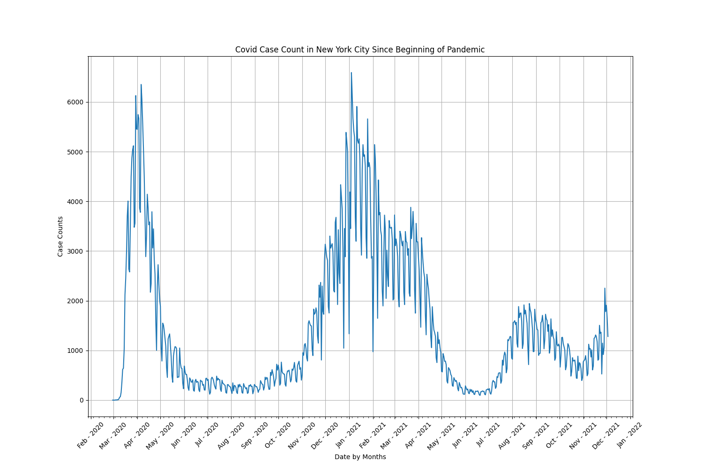

### Covid Cases and Deaths Over The Course of the Pandemic

The line graph below shows the timeline of covid cases and deaths in NYC during the pandemic.

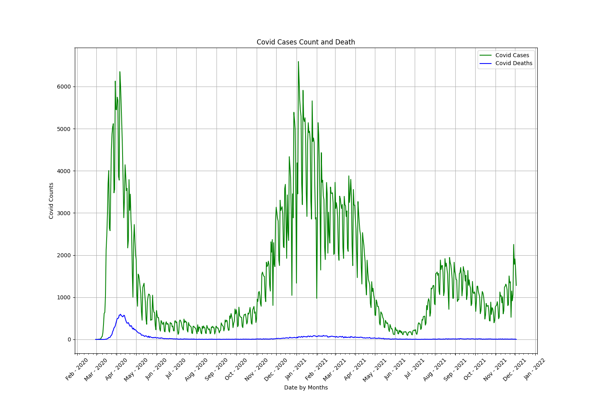

### Linear Relationship Between Vaccination and Covid Cases

Before performing linear regression we first check if a linear relationship exists between vaccination and covid cases. As we can see their is a correlation between the two.

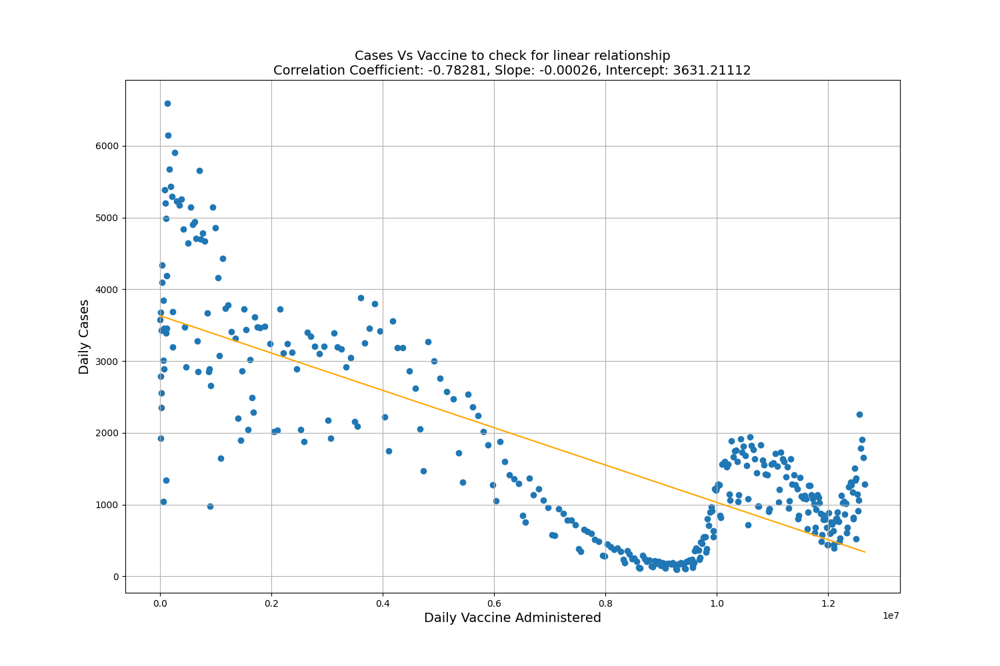

### Linear Regression on Vaccine and Cases

Using linear regression on vaccine and cases.

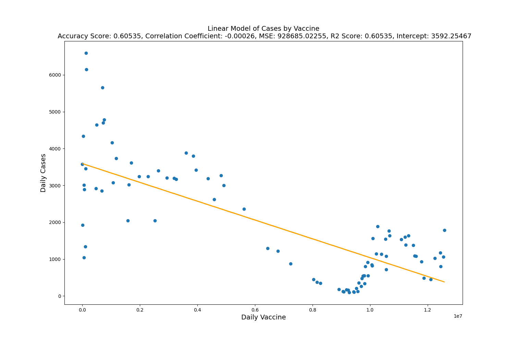

### Linear Relationship Between Covid Cases and Dates Over Time

Before performing linear regression we first check if a linear relationship exists with covid cases and dates over time. As we can see their is a correlation between the two.

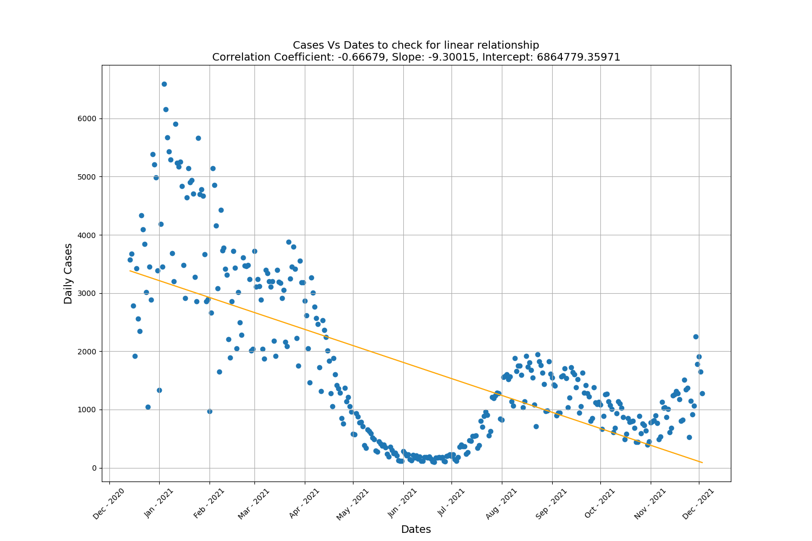

### Linear Regression on Vaccine and Dates Over Time

Using linear regression on cases and dates over time.

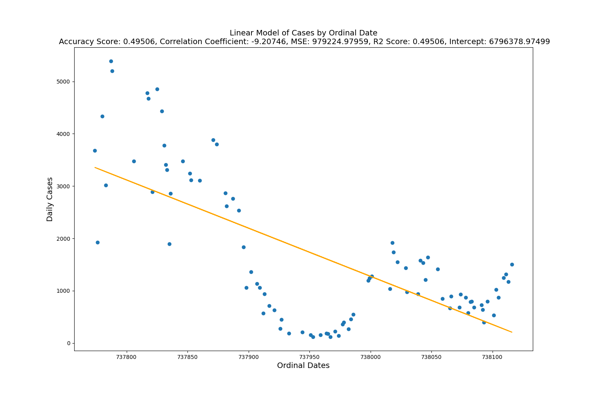

#### Multi Linear Relationship Between Covid Cases and Vaccination, Dates Over Time

Before performing multi linear regression we first check if a multi linear relationship exists between dates, vaccines and covid cases

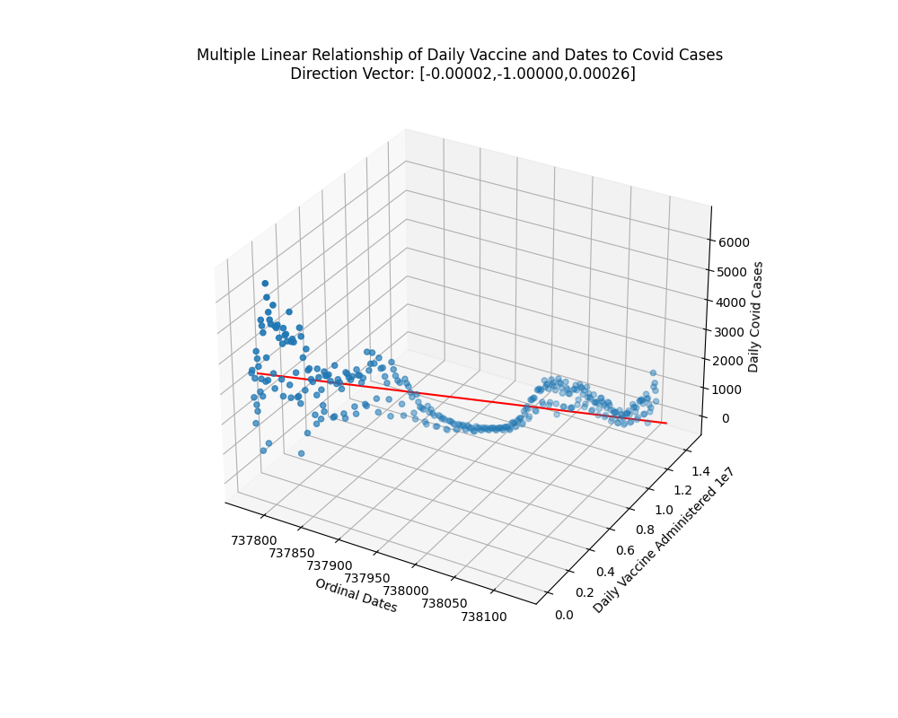

#### Multi Linear Regression Between Covid Cases and Vaccination, Dates Over Time

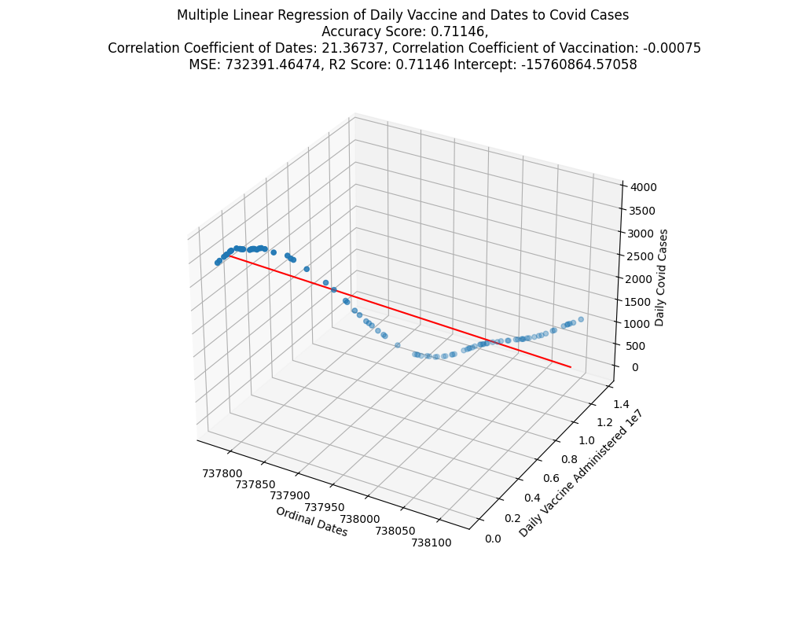

### Line Graph of Cases By Borough
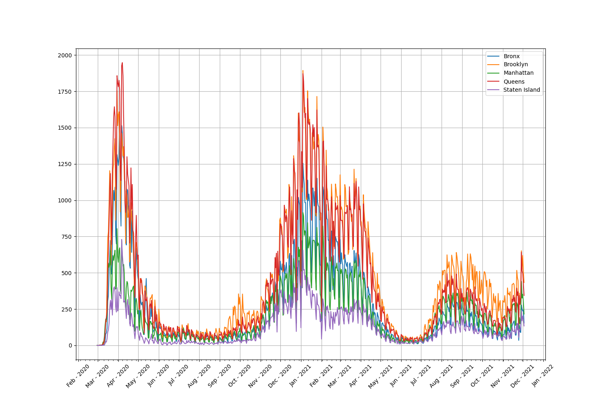

### Pie Chart of Cases By Borough
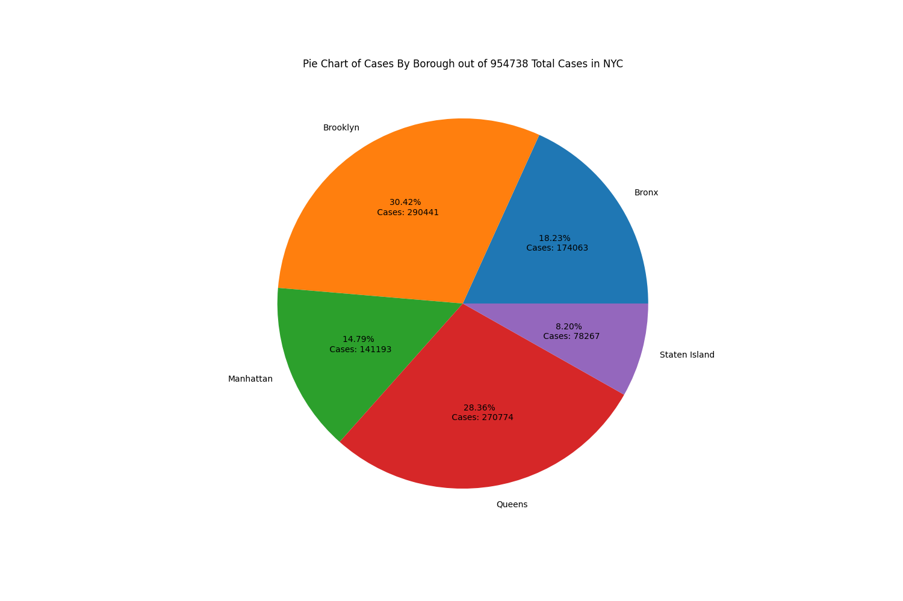

### Map of Cases By MODZCTA
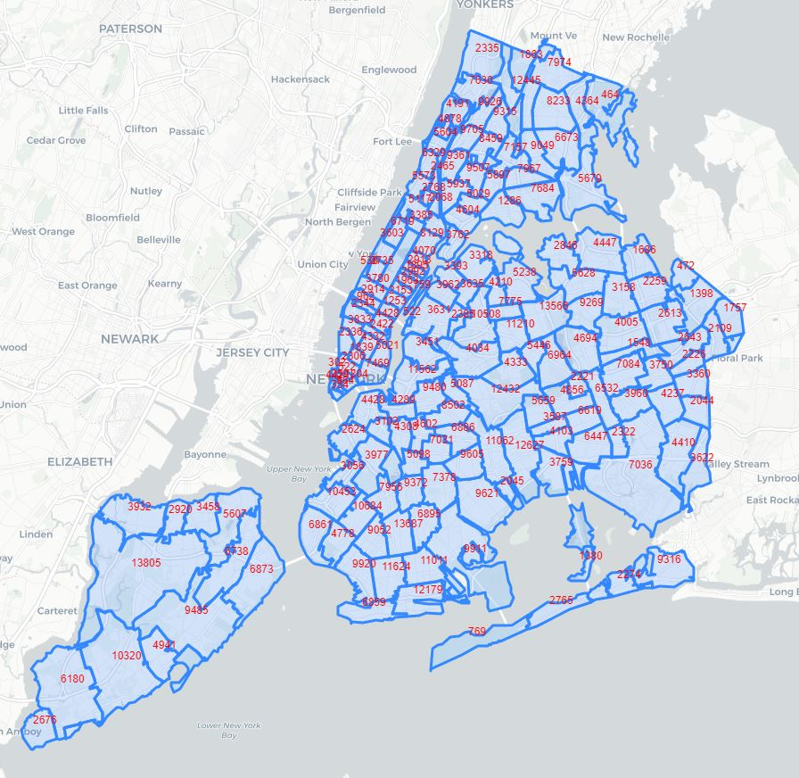

# Techniques

I used Python libraries like pandas to load and clean csv data and numpy to calculate slope, intercept and correlation for some of my graphs. For the analysis done on vaccine data to covid case data I had to use pandasql to perform a inner join on the two dataframes where the dates matched. This is because the vaccine was not available at the start of the pandemic and I had to filter out rows in the covid cases data where vaccine data did not exist. After this I used Linear Regression from the sklearn python library to analyze and predict relations between covid cases to vaccination and covid cases over time. Next, I performed Multi Linear Regression on vaccination and dates to covid cases. However, because linear regression doesn't work with datetime data, the dates were converted to a numeric ordinal format using the datetime library. Additionally, I used sklearn PCA to calculate the direction vectors for the multi linear regression models. I used matplotlib to display the graphs created. Matplotlib animations was used to create rotating gifs of the 3D models. Finally, I used folium to map the number of covid cases in each MODZCTA.

# Conclusion

In conclusion, according to the visualizations and linear regression analysis performed, as more and more people get vaccinated over time, covid cases will decrease.

# Citation
#### Data Sources:
- [https://github.com/nychealth/covid-vaccine-data/blob/main/doses/doses-by-day.csv ](https://github.com/nychealth/covid-vaccine-data/blob/main/doses/doses-by-day.csv)
- [https://github.com/nychealth/coronavirus-data/blob/master/totals/data-by-modzcta.csv ](https://github.com/nychealth/coronavirus-data/blob/master/totals/data-by-modzcta.csv )
- [https://github.com/nychealth/coronavirus-data/blob/master/trends/data-by-day.csv](https://github.com/nychealth/coronavirus-data/blob/master/trends/data-by-day.csv)
- [https://github.com/nychealth/coronavirus-data/blob/master/Geography-resources/MODZCTA_2010_WGS1984.geo.json](https://github.com/nychealth/coronavirus-data/blob/master/Geography-resources/MODZCTA_2010_WGS1984.geo.json)

#### Additional Resources:
- [https://stackoverflow.com/questions/65888553/fitting-a-line-through-3d-x-y-z-scatter-plot-data ](https://stackoverflow.com/questions/65888553/fitting-a-line-through-3d-x-y-z-scatter-plot-data )
- [https://stackoverflow.com/questions/51457738/animating-a-3d-scatterplot-with-matplotlib-to-gif-ends-up-empty](https://stackoverflow.com/questions/51457738/animating-a-3d-scatterplot-with-matplotlib-to-gif-ends-up-empty)
- [https://stackoverflow.com/questions/60252480/how-to-plot-3d-multiple-linear-regression-with-2-features-using-matplotlib](https://stackoverflow.com/questions/60252480/how-to-plot-3d-multiple-linear-regression-with-2-features-using-matplotlib)
